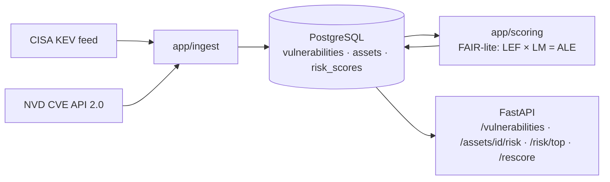

# Cyber Risk Quantification Platform

Ingests live vulnerability data (CISA KEV + NVD CVE API 2.0), scores technical severity, and
translates it into **expected annual financial loss** using [FAIR](https://www.fairinstitute.org/)
(Factor Analysis of Information Risk) methodology — served through a real backend/API/CI-CD stack
rather than a one-off script.

> **Status: Stage 1 of 7 (MVP).** The environment scaffold is up. There is no application logic yet
> — see [Build stages](#build-stages) for what lands when, and [PLAN.md](PLAN.md) for the full plan.

## Architecture (target)



Data flows one way: ingestion writes raw vulnerability facts, the scoring engine reads those plus the
curated asset list and writes derived `risk_scores`, and the API is a read layer over both (plus a
`POST /rescore` trigger).

## Setup

Requires Docker and Python 3.12.

```bash
git clone <this repo> && cd cyber-business-analysis-project

python3 -m venv .venv
source .venv/bin/activate
pip install -r requirements.txt

cp .env.example .env          # defaults work as-is for local dev
docker compose up -d          # starts Postgres 16 on localhost:5432
```

Verify the database is up:

```bash
docker compose ps             # db should report (healthy)
docker compose exec db psql -U postgres -d cyber_risk -c '\dt'
```

An empty database is the expected Stage 1 result — tables arrive in Stage 2.

Tear down (`-v` also drops the data volume for a clean slate):

```bash
docker compose down -v
```

## Configuration

Copy `.env.example` to `.env`. `.env` is gitignored and never committed.

| Variable | Purpose |
|---|---|
| `DATABASE_URL` | Connection string used by the app and Alembic from the host. Must match the Postgres credentials below. |
| `NVD_API_KEY` | Optional. Raises the NVD rate limit from 5 to 50 requests / 30s. Ingestion works without it, just slower. [Request one here.](https://nvd.nist.gov/developers/request-an-api-key) |
| `POSTGRES_USER` / `POSTGRES_PASSWORD` / `POSTGRES_DB` / `POSTGRES_PORT` | Consumed by `docker-compose.yml` to provision the local Postgres container. |

## Build stages

Each stage covers one layer of the stack or one integration point between two, and isn't complete
until its writeup is. Writeups are lab-notebook style — decisions, concepts, and what broke — read
in build order:

1. [Repo & environment scaffold](docs/writeups/01-repo-and-environment.md) ✅
2. Data layer — SQLAlchemy models, Alembic migrations, asset seed
3. Ingestion pipeline — CISA KEV + NVD, idempotent and re-runnable
4. Risk scoring engine — FAIR-lite LEF / LM / ALE
5. API layer — FastAPI routers and Pydantic schemas
6. Testing — scoring, ingestion (fixtures), API (`TestClient`)
7. Containerization + CI/CD — **MVP checkpoint**

Stretch stages (Monte Carlo ALE, scheduled worker, AWS, Terraform, dashboard) are deliberately gated
behind the Stage 7 checkpoint. See [PLAN.md](PLAN.md) §7.

## Methodology

Scoring uses FAIR terminology rather than an invented formula:

```
LEF (Loss Event Frequency) = threat_event_frequency × exploit_probability
LM  (Loss Magnitude)       = primary_loss_band(CIA impact) + secondary_loss(benchmark × sensitivity_tier)
ALE (Annualized Loss Expectancy) = LEF × LM
```

Every banding and scaling constant is documented with its justification in `docs/assumptions.md`,
written as each constant is chosen (Stage 4). The MVP ships point estimates; Stage 8 replaces them
with sampled distributions and a loss-exceedance curve.
