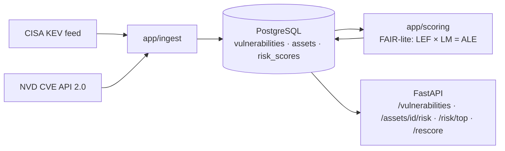

# Cyber Risk Quantification Platform

Ingests live vulnerability data (CISA KEV + NVD CVE API 2.0), scores technical severity, and
translates it into **expected annual financial loss** using [FAIR](https://www.fairinstitute.org/)
(Factor Analysis of Information Risk) methodology — served through a real backend/API/CI-CD stack
rather than a one-off script.

> **Status: not started.** This is also a from-scratch learning project — see
> [PLAN.md](PLAN.md) for the full build plan, including a concept primer for every technology used and
> a "Concepts you need first" list for each stage. Nothing below reflects code that exists yet.

## Architecture (target)



Data flows one way: ingestion writes raw vulnerability facts, the scoring engine reads those plus the
curated asset list and writes derived `risk_scores`, and the API is a read layer over both (plus a
`POST /rescore` trigger).

## Build stages

Each stage covers one layer of the stack or one integration point between two, and isn't complete
until its writeup is. See [PLAN.md](PLAN.md) for what each stage builds, the concepts it requires, and
why. Writeups land in `docs/writeups/` as each stage finishes and will be linked here in build order.

1. Repo & environment scaffold
2. Data layer — SQLAlchemy models, Alembic migrations, asset seed
3. Ingestion pipeline — CISA KEV + NVD, idempotent and re-runnable
4. Risk scoring engine — FAIR-lite LEF / LM / ALE
5. API layer — FastAPI routers and Pydantic schemas
6. Testing — scoring, ingestion (fixtures), API (`TestClient`)
7. Containerization + CI/CD — **MVP checkpoint**

Stretch stages (Monte Carlo ALE, scheduled worker, AWS, Terraform, dashboard) are deliberately gated
behind the Stage 7 checkpoint. See [PLAN.md](PLAN.md) §8.

Setup instructions land here once Stage 1 exists — see [PLAN.md](PLAN.md) for what that stage builds.

## Methodology

Scoring uses FAIR terminology rather than an invented formula:

```
LEF (Loss Event Frequency) = threat_event_frequency × exploit_probability
LM  (Loss Magnitude)       = primary_loss_band(CIA impact) + secondary_loss(benchmark × sensitivity_tier)
ALE (Annualized Loss Expectancy) = LEF × LM
```

Every banding and scaling constant is documented with its justification in `docs/assumptions.md`,
written as each constant is chosen (Stage 4). The MVP ships point estimates; Stage 8 replaces them
with sampled distributions and a loss-exceedance curve.
