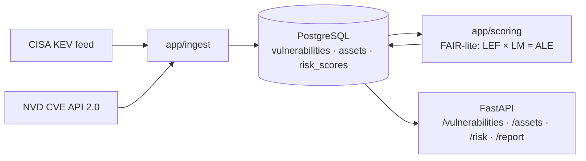

# Cyber Risk Quantification Platform

Ingests live vulnerability data (CISA KEV + NVD CVE API 2.0), works out which vulnerabilities affect
which business assets, and translates them into **expected annual financial loss** using
[FAIR](https://www.fairinstitute.org/) (Factor Analysis of Information Risk). The results are served
through a REST API and an executive risk report.

```
live CVE data ─► which assets does it hit? ─► LEF × LM = ALE ($/yr) ─► API + report
```

## Quick start

Prerequisites: Docker Desktop and Python 3.12.

```bash
cp .env.example .env              # set POSTGRES_PASSWORD (and the same password in DATABASE_URL)
                                  # optional: NVD_API_KEY for 10x faster NVD ingestion

# Option A: everything in Docker
docker compose up -d --build                              # Postgres + migrations + API
docker compose run --rm api python -m app.cli pipeline    # ingest live data, score, write report
open http://localhost:8000                                # the report

# Option B: Postgres in Docker, Python on your machine (for development)
python -m venv .venv && .venv/bin/pip install -r requirements-dev.txt
docker compose up -d db
make migrate
make pipeline          # seed assets → ingest KEV → ingest NVD → rescore → write report
make api               # http://localhost:8000, auto-reloads on code changes
```

`make help` lists every shortcut.

## Using it

### 1. What vulnerabilities affect us?

| | |
|---|---|
| `GET /vulnerabilities?kev_flag=true&min_cvss=9` | Actively exploited, critical CVEs |
| `GET /vulnerabilities?search=citrix` | Search by vendor, product, name or CVE ID |
| `GET /vulnerabilities/CVE-2021-44228` | One CVE with CVSS, KEV status, affected products |
| `GET /assets/{id}/risk` | Every CVE that applies to one asset, with its dollar exposure |

Interactive docs for every endpoint: **http://localhost:8000/docs**

### 2. What does it cost?

| | |
|---|---|
| `GET /risk/top?n=5` | Riskiest assets by annualized loss expectancy |
| `GET /risk/scenarios?n=20` | Riskiest individual (CVE, asset) pairs, with full FAIR breakdown |
| `POST /rescore` | Recompute all scores after changing assets or ingesting new data |

### 3. The report

- **http://localhost:8000/report** is rendered live from the database.
- **http://localhost:8000/report.md** is the same report as Markdown, to paste into a document and edit.
- `make report` writes both to `reports/risk_report_<date>.{md,html}`.

Sections: executive summary · risk register by asset · **remediation priorities** (which patches remove
the most dollars) · top scenarios with LEF/LM decomposition · per-asset detail · CVSS severity vs dollars ·
CWE breakdown · methodology and limitations.

### Modeling your own organization

The assets are a fictional mid-size fintech. To model something else, edit
[`scripts/seed_assets.py`](scripts/seed_assets.py): each asset's `type`, `sensitivity_tier` (1–3), and
`technologies` (software it runs, in NVD CPE `vendor:product` form, e.g. `apache:log4j`). Then run:

```bash
make seed && make rescore && make report
```

To find the right CPE name for a product, search [NVD's CPE dictionary](https://nvd.nist.gov/products/cpe/search).

### Keeping data fresh

Everything is idempotent, so re-running is always safe:

```bash
make ingest rescore report                                         # refresh KEV + NVD, rescore
.venv/bin/python -m app.cli ingest-nvd --modified-since-days 30    # also pull non-KEV CVEs
.venv/bin/python -m app.cli ingest-nvd --cve CVE-2024-3400          # one specific CVE
```

## Methodology

```
ALE (annualized loss expectancy) = LEF × LM                       $ / year
LEF (loss event frequency)       = TEF × P(exploit)                events / year
    TEF        threat event frequency, by asset exposure (×1.5 if ransomware-linked)
    P(exploit) CVSS exploitability sub-score × 0.10  (×6 if in CISA KEV)
LM  (loss magnitude)             = primary + secondary loss         $ / event
    primary    CVSS C/I/A impact band × 60% of $4.88M breach benchmark
    secondary  40% of benchmark × sensitivity tier/3 × confidentiality factor

Per asset ("an attacker needs one open door", not a plain sum):
    asset LEF = TEF × P(at least one applicable CVE works) = TEF × (1 − Π(1 − pᵢ))
    asset ALE = asset LEF × probability-weighted average LM
```

Every constant and its justification is in **[docs/assumptions.md](docs/assumptions.md)**, including what
the model does *not* know (patch state, controls, uncertainty). Figures are inherent-risk point
estimates for prioritization, not forecasts.

## Architecture



Details: **[docs/architecture.md](docs/architecture.md)**.

| Concern | How |
|---|---|
| Stack | FastAPI · PostgreSQL 16 · SQLAlchemy 2 · Alembic · Pydantic · Jinja2 |
| Idempotent ingestion | Postgres `ON CONFLICT` upserts; each feed may only overwrite the columns it owns |
| Rate limits | Paced client plus exponential backoff (`app/ingest/http.py`) |
| Testing | pytest: hand-computed scoring answers, recorded API fixtures (no live calls), `TestClient` API tests against real Postgres |
| Containers | `Dockerfile` (non-root) · compose with healthcheck-gated startup and a one-shot migration job |
| CI/CD | GitHub Actions: lint + migrations up/down + tests on every PR; image pushed to GHCR on merge to `main` |

## Development

```bash
make test      # pytest; DB tests use a separate <db>_test database and skip if Postgres is down
make lint      # ruff
make revision M="describe the change"   # after editing app/models.py, then review the file it writes
```

## Build stages

See [PLAN.md](PLAN.md) for the staged learning plan. Stages 1–7 (the MVP checkpoint) are implemented.
Writeups for each stage go in `docs/writeups/`.

Next (PLAN.md §8): Monte Carlo ALE with loss-exceedance curves · scheduled re-ingestion worker · AWS
deployment · Terraform.
