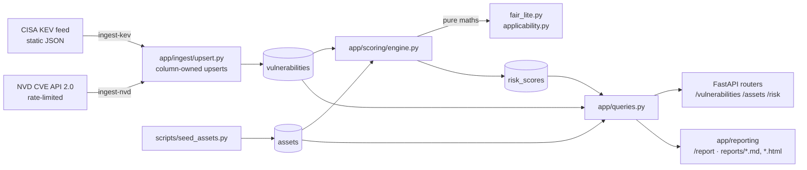

# Architecture



## Layers

| Layer | Files | Responsibility |
|---|---|---|
| Config | `app/config.py` | Reads `.env` once and fails loudly if `DATABASE_URL` is missing |
| Data | `app/models.py`, `alembic/` | Schema as ORM classes, and version-controlled migrations |
| Ingestion | `app/ingest/` | Fetch, parse (pure), idempotent upsert. `http.py` handles pacing and retries |
| Scoring | `app/scoring/` | `fair_lite.py` and `applicability.py` are pure functions. `engine.py` is the thin DB loop |
| Read model | `app/queries.py` | Every aggregate shared by the API and the report, so the two can never disagree |
| Delivery | `app/main.py`, `app/routers/`, `app/reporting/`, `app/cli.py` | HTTP API, HTML/Markdown report, batch CLI |

## Data flow and ownership

Data moves one way: **raw facts → derived scores → read views.**

- `vulnerabilities` holds observed facts. Each column is owned by exactly one feed (KEV or NVD), and each
  feed's upsert may only overwrite its own columns. `cwe_ids` is shared: NVD wins.
- `assets` holds modeling inputs, hand-curated. Includes `technologies`, the stack used for applicability.
- `risk_scores` holds derived output only, fully reproducible by `rescore`. It stores every intermediate
  FAIR value (TEF, P(exploit), LEF, primary and secondary loss, LM), not just ALE, so any figure in the
  report can be traced to its inputs.

## Idempotency, everywhere

| Operation | Mechanism |
|---|---|
| KEV / NVD ingest | `INSERT … ON CONFLICT (cve_id) DO UPDATE` on owned columns only |
| CVE removed from KEV | `clear_stale_kev_flags`, guarded against empty or truncated feeds |
| Rescore | Upsert on `(asset_id, cve_id)`, then delete rows with an older `computed_at` |
| Asset seed | Upsert on unique `name` |
| Schema | Alembic's `alembic_version` table records what has been applied |

## Runtime topology (docker compose)

```
host:8000 ──► api (uvicorn) ──► db:5432 (postgres:16, volume pgdata)
                   ▲
          migrate (one-shot: alembic upgrade head)
```

`api` waits for `migrate` to finish successfully, which waits for `db`'s healthcheck (`pg_isready`).
Inside the compose network the database host is `db`. From your machine it is `localhost:5432`.

## CI/CD

`.github/workflows/ci.yml`:

1. **test** job (every PR and push to main): ruff lint → migrations up, down and up again → pytest,
   against a throwaway Postgres service container, with `REQUIRE_DB=1`.
2. **image** job (push to main, after test passes): build the Dockerfile and push it to
   `ghcr.io/<owner>/<repo>:latest` and `:<sha>`.
